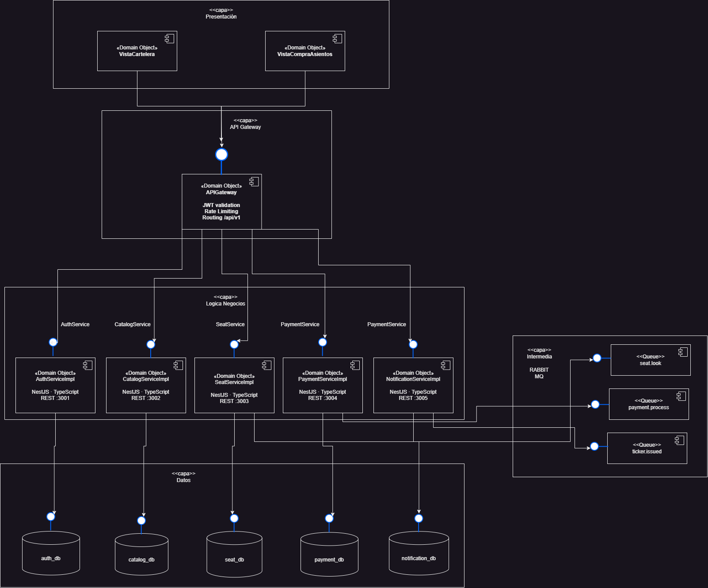
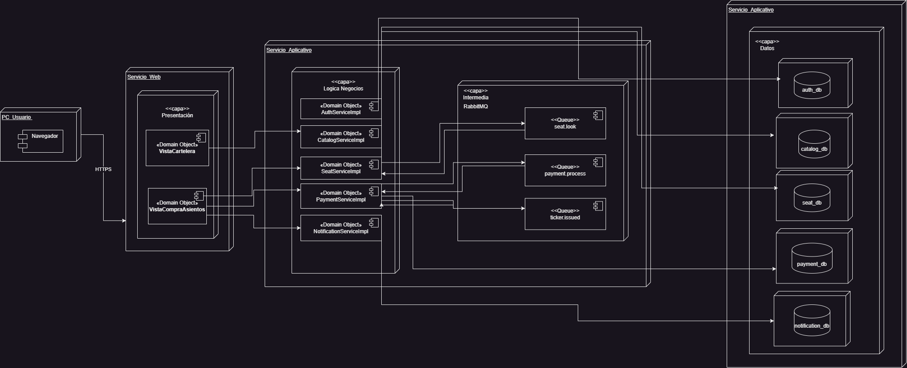

##  Índice

1. [Introducción](#introducción)
2. [Diagrama Entidad-Relación (ER)](#diagrama-entidad-relación-er)
3. [Diagrama de Componentes](#diagrama-de-componentes)
4. [Diagrama de Despliegue](#diagrama-de-despliegue)
5. [Conclusiones](#conclusiones)

---

## Introducción

FilmStars es una plataforma digital de venta de boletos en línea para una cadena de cines. El sistema está diseñado bajo una **Arquitectura Orientada a Servicios (SOA)** con enfoque de microservicios, garantizando alta disponibilidad, escalabilidad ante picos de demanda y eliminación de condiciones de carrera al seleccionar asientos de forma simultánea.

La comunicación crítica entre servicios se gestiona de forma **asíncrona** mediante RabbitMQ como middleware de mensajería, mientras que las operaciones de consulta utilizan comunicación **síncrona** REST/HTTP a través de un API Gateway centralizado.

El sistema está compuesto por cinco microservicios independientes, cada uno con su propia base de datos PostgreSQL siguiendo el patrón **Database per Service**:

- **auth-service** — Autenticación y gestión de sesiones
- **catalog-service** — Películas, cines, salas y funciones
- **seat-service** — Gestión de asientos y estado en tiempo real
- **payment-service** — Procesamiento de órdenes y pagos
- **notification-service** — Envío de notificaciones y boletos por correo

---

## Diagrama Entidad-Relación (ER)

El diseño de base de datos sigue el principio de **Database per Service**: cada microservicio posee su propio esquema PostgreSQL aislado. Las relaciones entre servicios distintos se modelan como **referencias lógicas por ID** (sin FK reales cross-service), preservando el desacoplamiento de la arquitectura.

### auth-service — `auth_db`

Gestiona usuarios registrados y sus sesiones activas.

| Entidad | Atributos principales |
|---|---|
| `users` | user_id (PK), email, password_hash, fullname, date_creation, status |
| `users_sessions` | session_id (PK), user_id (FK), jwt_token, expires_date, create_date |

**Relación:** Un usuario puede tener múltiples sesiones activas (`users` 1 — N `users_sessions`).

---

### catalog-service — `catalog_db`

Administra el catálogo de películas, la red de cines, salas y funciones disponibles.

| Entidad | Atributos principales |
|---|---|
| `movies` | movie_id (PK), title, description, genre, duration_min, category, poster_url, release_date |
| `cine` | cinema_id (PK), name, city, address |
| `sala` | room_id (PK), cinema_id (FK), name, total_seats |
| `funciones` | screening_id (PK), movie_id (FK), room_id (FK), start_time, end_time, price |

**Relaciones:**
- `cine` 1 — N `sala`
- `movies` 1 — N `funciones`
- `sala` 1 — N `funciones`

---

### seat-service — `seat_db`

Controla el inventario de asientos y su estado en tiempo real por función.

| Entidad | Atributos principales |
|---|---|
| `asientos` | asiento_id (PK), sala_id (ref. lógica), fila_etiqueta, numero_asiento, numero_fila |
| `estado_asientos` | status_id (PK), asiento_id (FK), screening_id (ref. lógica), status, blocked_by_user, blocked_until, updated_at |

**Relación:** Un asiento tiene múltiples estados históricos por función (`asientos` 1 — N `estado_asientos`).

---

### payment-service — `payment_db`

Gestiona el ciclo de vida de órdenes de compra, ítems y boletos emitidos.

| Entidad | Atributos principales |
|---|---|
| `orden` | order_id (PK), user_id (ref. lógica), screening_id (ref. lógica), total_orden, status, fecha_creacion |
| `orden_item` | item_id (PK), order_id (FK), asiento_id (ref. lógica), unit_price |
| `tickets` | ticket_id (PK), order_id (FK), qr_code, status, fecha_uso |

**Relaciones:**
- `orden` 1 — N `orden_item`
- `orden` 1 — N `tickets`

---

### notification-service — `notification_db`

Registra todas las notificaciones enviadas al usuario.

| Entidad | Atributos principales |
|---|---|
| `notifications` | notification_id (PK), user_id (ref. lógica), type, payment_notification (ref. lógica), date_notification, status_notification |

---

### Referencias lógicas cross-service

Las siguientes relaciones existen a nivel de negocio pero **no se implementan como FK reales** para mantener el desacoplamiento entre servicios:

| Desde | Hacia | Descripción |
|---|---|---|
| `estado_asientos.screening_id` | `funciones.screening_id` | Estado de asiento vinculado a una función |
| `orden.user_id` | `users.user_id` | Orden pertenece a un usuario |
| `orden_item.asiento_id` | `asientos.asiento_id` | Ítem de orden vinculado a un asiento |
| `notifications.user_id` | `users.user_id` | Notificación dirigida a un usuario |
| `notifications.payment_notification` | `orden.order_id` | Notificación originada por una orden |

---

### Imagen del Diagrama ER

---

## Diagrama de Componentes

El diagrama de componentes muestra la organización lógica del sistema en cuatro capas horizontales, detallando las interfaces expuestas, las dependencias entre módulos y la naturaleza de cada comunicación (síncrona vs. asíncrona).

### Capas del sistema

**Capa de Presentación**
Contiene los componentes de interfaz de usuario que el cliente ejecuta en el navegador:
- `VistaCartelera` — Consulta de películas, cines y funciones disponibles
- `VistaCompraAsientos` — Selección de asientos, flujo de pago y emisión de boleto

**Capa API Gateway**
Punto de entrada único al sistema. Centraliza autenticación JWT, rate limiting y enrutamiento hacia los microservicios internos bajo el prefijo `/api/v1`.

**Capa de Microservicios**
Cinco servicios independientes desarrollados en NestJS + TypeScript, cada uno expuesto en su propio puerto:

| Componente | Puerto | Responsabilidad |
|---|---|---|
| AuthServiceImpl | :3001 | Registro, login, validación de tokens |
| CatalogServiceImpl | :3002 | Consulta de películas, cines y funciones |
| SeatServiceImpl | :3003 | Bloqueo y liberación de asientos en tiempo real |
| PaymentServiceImpl | :3004 | Procesamiento de órdenes y pagos simulados |
| NotificationServiceImpl | :3005 | Envío de correos y boletos digitales |

**Capa de Mensajería y Datos**
- **RabbitMQ Broker** con tres queues especializadas:
  - `seat.lock` — Gestiona el bloqueo temporal de asientos
  - `payment.process` — Procesa las órdenes de pago de forma asíncrona
  - `ticket.issued` — Dispara el envío del boleto al usuario
- **PostgreSQL** — Una instancia de base de datos por microservicio: `auth_db`, `catalog_db`, `seat_db`, `payment_db`, `notification_db`

### Comunicación entre componentes

| Tipo | Protocolo | Uso |
|---|---|---|
| Síncrona | REST/HTTP | Presentación → Gateway → Microservicios |
| Asíncrona | AMQP (RabbitMQ) | Seat/Payment → Queues → Consumers |
| Persistencia | SQL/TCP :5432 | Microservicios → PostgreSQL |

### Imagen del Diagrama de Componentes

---

## Diagrama de Despliegue

El diagrama de despliegue mapea cada componente lógico a su nodo de infraestructura físico o virtual. El sistema se despliega sobre **Google Cloud Platform (GCP)** usando contenedores Docker orquestados con `docker-compose`.

### Nodos de infraestructura

**PC_Usuario**
Dispositivo cliente del usuario final. Ejecuta el navegador web que consume la interfaz de FilmStars mediante HTTPS.

**Servicio_Web**
Nodo que aloja la capa de presentación:
- `VistaCartelera` y `VistaCompraAsientos`
- Comunicación hacia el backend vía `HTTPS :443`

**Servicio_Aplicativo — Lógica de Negocios**
Nodo principal de GCP Cloud Run que contiene:
- API Gateway (NestJS, puerto 3000)
- Los cinco microservicios en contenedores Docker independientes
- Cada imagen versionada como `nombre-servicio:1.0.0`

**Servicio_Aplicativo — Intermediario (RabbitMQ)**
Contenedor RabbitMQ 3.12 dentro del mismo nodo aplicativo:
- Puerto `5672` para comunicación AMQP
- Puerto `15672` para panel de administración
- Imagen: `rabbitmq:3-management`
- Queues: `seat.lock`, `payment.process`, `ticket.issued`

**Servicio_Aplicativo — Datos (GCP Cloud SQL)**
Nodo de persistencia con cinco instancias PostgreSQL 15 aisladas:

| Base de datos | Puerto | Microservicio propietario |
|---|---|---|
| auth_db | 5432 | auth-service |
| catalog_db | 5432 | catalog-service |
| seat_db | 5432 | seat-service |
| payment_db | 5432 | payment-service |
| notification_db | 5432 | notification-service |

### Comunicaciones del despliegue

| Origen | Destino | Protocolo |
|---|---|---|
| PC_Usuario | Servicio_Web | HTTPS |
| Servicio_Web | API Gateway | HTTPS :443 |
| API Gateway | auth-service | HTTP :3001 |
| API Gateway | catalog-service | HTTP :3002 |
| API Gateway | seat-service | HTTP :3003 |
| API Gateway | payment-service | HTTP :3004 |
| seat-service | RabbitMQ | AMQP publish |
| payment-service | RabbitMQ | AMQP publish |
| RabbitMQ | seat-service | AMQP consume |
| RabbitMQ | payment-service | AMQP consume |
| RabbitMQ | notification-service | AMQP consume |
| Cada microservicio | Su PostgreSQL | TCP :5432 |

### Imagen del Diagrama de Despliegue

---

## Conclusiones

- La arquitectura de microservicios con **Database per Service** garantiza el aislamiento de dominios de negocio, permitiendo que cada servicio evolucione, escale y falle de forma independiente sin afectar al resto del sistema.

- El uso de **RabbitMQ como message broker** elimina las condiciones de carrera en la selección de asientos al serializar las solicitudes de bloqueo a través de la queue `seat.lock`, garantizando que dos usuarios no puedan reservar el mismo asiento simultáneamente.

- El patrón de **referencias lógicas cross-service** (sin FK reales entre bases de datos) es fundamental en arquitecturas de microservicios, ya que preserva el desacoplamiento y permite que cada servicio sea el único dueño de sus datos.

- El **API Gateway** como punto de entrada único centraliza las preocupaciones transversales (autenticación JWT, rate limiting, enrutamiento), simplificando la lógica de los microservicios internos y mejorando la seguridad del sistema.

- El despliegue en **GCP con contenedores Docker** permite reproducibilidad del entorno, escalabilidad horizontal de servicios con alta demanda (como seat-service durante el lanzamiento de preventas) y facilita el ciclo de integración y entrega continua.