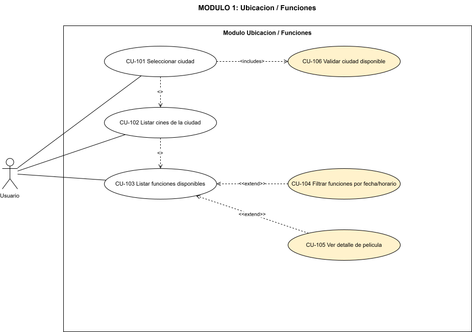
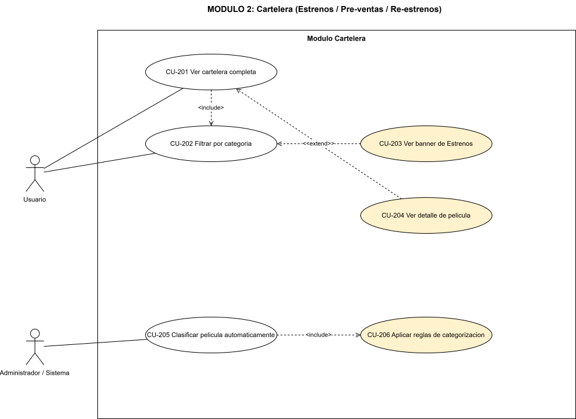
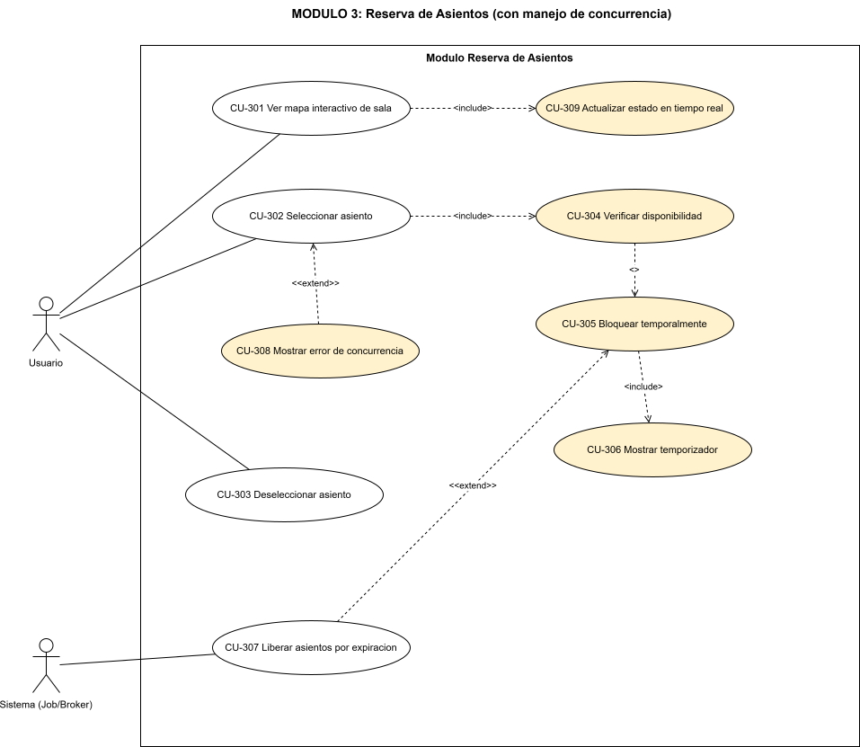
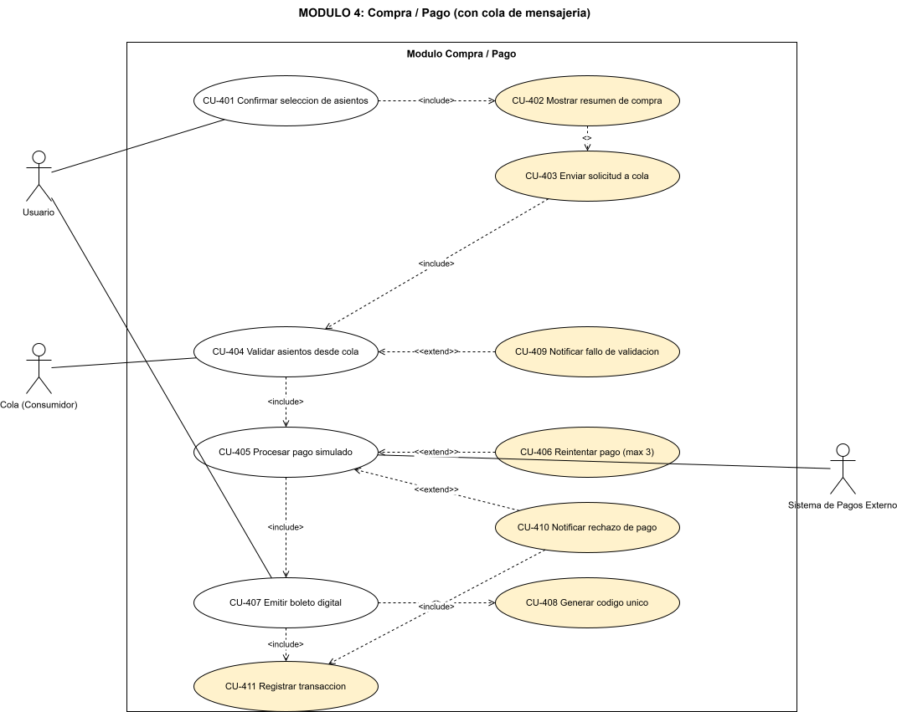

# Casos de Uso Expandidos - FilmStars

> Plataforma web de venta de boletos de cine bajo arquitectura **SOA**, con comunicación crítica vía **cola de mensajería asíncrona** (RabbitMQ/Kafka), bloqueo temporal de asientos con **TTL** y control de **concurrencia** para venta en tiempo real.

---

## Tabla de Contenidos

### Módulo 1: Ubicación/Funciones
- [CU-101: Seleccionar ciudad](#cu-101-seleccionar-ciudad)
- [CU-102: Listar cines de la ciudad](#cu-102-listar-cines-de-la-ciudad)
- [CU-103: Listar funciones disponibles](#cu-103-listar-funciones-disponibles)
- [CU-104: Filtrar funciones por fecha/horario](#cu-104-filtrar-funciones-por-fechahorario)
- [CU-105: Ver detalle de película](#cu-105-ver-detalle-de-pelicula)
- [CU-106: Validar ciudad disponible](#cu-106-validar-ciudad-disponible)

### Módulo 2: Cartelera
- [CU-201: Ver cartelera completa](#cu-201-ver-cartelera-completa)
- [CU-202: Filtrar por categoría (Estrenos/Pre-ventas/Re-estrenos)](#cu-202-filtrar-por-categoria-estrenospre-ventasre-estrenos)
- [CU-203: Ver banner de Estrenos](#cu-203-ver-banner-de-estrenos)
- [CU-204: Ver detalle de película desde cartelera](#cu-204-ver-detalle-de-pelicula-desde-cartelera)
- [CU-205: Clasificar película automáticamente](#cu-205-clasificar-pelicula-automaticamente)
- [CU-206: Aplicar reglas de categorización](#cu-206-aplicar-reglas-de-categorizacion)

### Módulo 3: Reserva de Asientos
- [CU-301: Ver mapa interactivo de sala](#cu-301-ver-mapa-interactivo-de-sala)
- [CU-302: Seleccionar asiento](#cu-302-seleccionar-asiento)
- [CU-303: Deseleccionar asiento](#cu-303-deseleccionar-asiento)
- [CU-304: Verificar disponibilidad del asiento](#cu-304-verificar-disponibilidad-del-asiento)
- [CU-305: Bloquear temporalmente el asiento](#cu-305-bloquear-temporalmente-el-asiento)
- [CU-306: Mostrar temporizador de bloqueo](#cu-306-mostrar-temporizador-de-bloqueo)
- [CU-307: Liberar asientos por expiración TTL](#cu-307-liberar-asientos-por-expiracion-ttl)
- [CU-308: Mostrar mensaje de error de concurrencia](#cu-308-mostrar-mensaje-de-error-de-concurrencia)
- [CU-309: Actualizar estado del asiento en tiempo real](#cu-309-actualizar-estado-del-asiento-en-tiempo-real)

### Módulo 4: Compra/Pago
- [CU-401: Confirmar selección de asientos](#cu-401-confirmar-seleccion-de-asientos)
- [CU-402: Mostrar resumen de compra](#cu-402-mostrar-resumen-de-compra)
- [CU-403: Enviar solicitud a cola de mensajería](#cu-403-enviar-solicitud-a-cola-de-mensajeria)
- [CU-404: Validar asientos desde cola](#cu-404-validar-asientos-desde-cola)
- [CU-405: Procesar pago simulado](#cu-405-procesar-pago-simulado)
- [CU-406: Reintentar pago hasta 3 veces](#cu-406-reintentar-pago-hasta-3-veces)
- [CU-407: Emitir boleto digital](#cu-407-emitir-boleto-digital)
- [CU-408: Generar código único de boleto](#cu-408-generar-codigo-unico-de-boleto)
- [CU-409: Notificar fallo de validación de asientos](#cu-409-notificar-fallo-de-validacion-de-asientos)
- [CU-410: Notificar rechazo de pago](#cu-410-notificar-rechazo-de-pago)
- [CU-411: Registrar transacción en historial](#cu-411-registrar-transaccion-en-historial)

---

## Resumen de los Módulos

| Módulo | Nombre | Propósito | CDUs | Criticidad |
|--------|--------|-----------|------|------------|
| **1** | Ubicación/Funciones | Permite al usuario seleccionar su ciudad y descubrir cines, funciones, horarios y detalle de películas disponibles en esa localidad. | CU-101 → CU-106 | Media |
| **2** | Cartelera | Presenta el catálogo de películas clasificado por tipo de proyección (Estrenos, Pre-ventas, Re-estrenos) y automatiza la categorización. | CU-201 → CU-206 | Media |
| **3** | Reserva de Asientos | Gestiona la selección de asientos en tiempo real, el bloqueo temporal con TTL y el control de concurrencia para evitar condiciones de carrera. **Núcleo crítico del sistema.** | CU-301 → CU-309 | **Alta** |
| **4** | Compra/Pago | Orquesta el flujo de compra de extremo a extremo mediante una cola de mensajería asíncrona (validación → pago → emisión de boleto) con tolerancia a fallos. **Núcleo crítico del sistema.** | CU-401 → CU-411 | **Alta** |

---

## Leyenda

### Actores

| Actor | Descripción |
|-------|-------------|
| **Usuario** | Cliente final que navega el catálogo, selecciona asientos y compra boletos. |
| **Administrador** | Personal del cine que gestiona contenido y supervisa la clasificación de películas. |
| **Sistema (Job/Broker)** | Procesos automáticos no atendidos: jobs programados (p. ej. liberación por TTL), publicadores/consumidores del broker de mensajería. |
| **Cola (Consumidor)** | Servicio consumidor que lee mensajes del broker y ejecuta la validación de asientos de forma asíncrona. |
| **Sistema de Pagos Externo** | Pasarela de pago simulada que autoriza o rechaza transacciones. |

### Tipos de Caso de Uso

| Tipo | Significado |
|------|-------------|
| **Principal** | Caso de uso iniciado directamente por un actor con valor de negocio observable. |
| **Include** | Comportamiento técnico obligatorio reutilizado por otro CDU (relación `«include»`). Siempre se ejecuta. |
| **Extend** | Comportamiento condicional que extiende un CDU base solo bajo ciertas condiciones (relación `«extend»`). |

### Tipos de Flujo

| Notación | Descripción |
|----------|-------------|
| **Flujo Principal** | Camino feliz; secuencia ideal sin errores. |
| **FA-n** | Flujo Alternativo; variación válida del comportamiento que aún logra el objetivo. |
| **FE-n** | Flujo de Excepción; manejo de errores que impide (total o parcialmente) el objetivo. |

### Convenciones técnicas

- **TTL (Time To Live):** tiempo de vida del bloqueo temporal de un asiento = **5 minutos exactos** (RNF-09).
- **Optimistic locking:** control de concurrencia mediante versión/CAS (`compare-and-set`) sin bloqueos pesimistas de larga duración.
- **Idempotencia:** una operación puede repetirse sin alterar el resultado más allá del primer efecto (clave `idempotency_key`).
- **DLQ (Dead Letter Queue):** cola de mensajes fallidos para mensajes no procesables tras N reintentos.
- **Backoff exponencial:** estrategia de reintentos donde el tiempo de espera crece geométricamente entre intentos.

---

# Módulo 1: Ubicación/Funciones

> **Diagrama local del módulo** (descomposición con relaciones `«include»`/`«extend»`). Archivo crudo: [`Modulo1.drawio`](Modulo1.drawio).

*Los casos de uso expandidos de este módulo (CU-101 a CU-106) se detallan a continuación.*

## CU-101: Seleccionar ciudad

| Campo | Detalle |
|---|---|
| **Código** | CU-101 |
| **Módulo** | Ubicación/Funciones |
| **Actor(es) principal(es)** | Usuario |
| **Actor(es) secundario(s)** | Servicio de Ubicación (SOA) |
| **Prioridad** | Alta |
| **Tipo** | Principal |
| **Precondiciones** | 1. El usuario ha accedido a la plataforma web de FilmStars. 2. El Servicio de Ubicación está disponible y posee al menos una ciudad registrada. |
| **Postcondiciones** | • **Éxito:** La ciudad queda fijada en el contexto de la sesión del usuario y la cartelera/funciones se contextualizan a esa ciudad. • **Fallo:** No se fija ninguna ciudad; el sistema permanece en el estado previo y muestra el motivo del error. |
| **Flujo Principal** | 1. El usuario abre el selector de ubicación. 2. El sistema solicita al Servicio de Ubicación el listado de ciudades disponibles. 3. El sistema muestra el listado de ciudades ordenado alfabéticamente. 4. El usuario selecciona una ciudad del listado. 5. El sistema ejecuta «include» **CU-106: Validar ciudad disponible**. 6. El sistema almacena la ciudad seleccionada en el contexto de sesión. 7. El sistema confirma la selección y redirige a la cartelera/funciones de la ciudad. |
| **Flujos Alternativos** | **FA-1: Detección automática por geolocalización** 1. El sistema solicita permiso de geolocalización al navegador. 2. Si se concede, el sistema sugiere la ciudad más cercana como preselección. 3. El usuario confirma o cambia la sugerencia, retomando el paso 4 del flujo principal.  **FA-2: Búsqueda por nombre** 1. El usuario escribe el nombre de la ciudad en un campo de búsqueda con autocompletado. 2. El sistema filtra el listado en tiempo real y el usuario selecciona, retomando el paso 5. |
| **Flujos de Excepción** | **FE-1: Servicio de Ubicación no disponible** 1. La petición al Servicio de Ubicación falla o excede el timeout. 2. El sistema muestra el mensaje "No fue posible cargar las ciudades, intenta nuevamente". 3. El sistema ofrece un botón de reintento y mantiene la última ciudad en caché (si existe).  **FE-2: No existen ciudades registradas** 1. El Servicio de Ubicación devuelve una lista vacía. 2. El sistema informa "Por el momento no hay ciudades disponibles" y deshabilita la navegación a cartelera. |
| **Reglas de Negocio** | • Solo puede haber **una ciudad activa** por sesión a la vez. • La selección de ciudad es **obligatoria** antes de navegar funciones o comprar boletos. • Las ciudades se muestran ordenadas alfabéticamente de forma ascendente. |
| **Requerimientos asociados** | • RF-01 • RNF-06 (la ciudad se persiste en contexto autenticado/cookie segura) |

---

## CU-102: Listar cines de la ciudad

| Campo | Detalle |
|---|---|
| **Código** | CU-102 |
| **Módulo** | Ubicación/Funciones |
| **Actor(es) principal(es)** | Usuario |
| **Actor(es) secundario(s)** | Servicio de Ubicación (SOA) |
| **Prioridad** | Alta |
| **Tipo** | Principal |
| **Precondiciones** | 1. El usuario ha seleccionado una ciudad válida (CU-101 completado). 2. El Servicio de Ubicación está disponible. |
| **Postcondiciones** | • **Éxito:** Se muestra el listado de cines pertenecientes a la ciudad seleccionada. • **Fallo:** No se muestra ningún cine; se notifica el error sin perder el contexto de ciudad. |
| **Flujo Principal** | 1. El sistema toma la ciudad activa del contexto de sesión. 2. El sistema solicita al Servicio de Ubicación los cines asociados a esa ciudad. 3. El servicio devuelve los cines con nombre, dirección y número de salas. 4. El sistema muestra los cines en formato de tarjetas/listado. 5. El usuario puede seleccionar un cine para ver sus funciones. |
| **Flujos Alternativos** | **FA-1: Ordenamiento por cercanía** 1. Si hay geolocalización disponible, el sistema ordena los cines por distancia al usuario. |
| **Flujos de Excepción** | **FE-1: La ciudad no tiene cines registrados** 1. El servicio devuelve lista vacía. 2. El sistema muestra "No hay cines disponibles en esta ciudad" y sugiere cambiar de ciudad.  **FE-2: Error de comunicación con el servicio** 1. La petición falla o supera el timeout. 2. El sistema muestra mensaje de error con opción de reintento. |
| **Reglas de Negocio** | • Solo se listan cines **activos** (con al menos una función publicada) de la ciudad seleccionada. • Un cine pertenece a una única ciudad. |
| **Requerimientos asociados** | • RF-02 • RNF-16 (latencia interna entre servicios ≤ 100 ms) |

---

## CU-103: Listar funciones disponibles

| Campo | Detalle |
|---|---|
| **Código** | CU-103 |
| **Módulo** | Ubicación/Funciones |
| **Actor(es) principal(es)** | Usuario |
| **Actor(es) secundario(s)** | Servicio de Funciones (SOA) |
| **Prioridad** | Alta |
| **Tipo** | Principal |
| **Precondiciones** | 1. El usuario ha seleccionado una ciudad (y opcionalmente un cine). 2. El Servicio de Funciones está disponible. |
| **Postcondiciones** | • **Éxito:** Se muestran las funciones disponibles con su horario, sala y película asociada. • **Fallo:** No se muestran funciones; se notifica el error. |
| **Flujo Principal** | 1. El sistema solicita al Servicio de Funciones las funciones de la ciudad/cine activo. 2. El servicio devuelve cada función con: película, horario, número de sala y disponibilidad. 3. El sistema muestra las funciones agrupadas por película y ordenadas por horario. 4. El usuario puede seleccionar una función para iniciar la reserva de asientos. |
| **Flujos Alternativos** | **FA-1: Agrupación por cine** 1. Si el usuario llegó desde el listado de cines, las funciones se agrupan por sala dentro del cine seleccionado. |
| **Flujos de Excepción** | **FE-1: No hay funciones programadas** 1. El servicio devuelve lista vacía para la fecha actual. 2. El sistema muestra "No hay funciones disponibles" y ofrece ver fechas próximas.  **FE-2: Función con datos incompletos** 1. Una función carece de sala o horario válido. 2. El sistema omite esa función del listado y registra la inconsistencia para auditoría. |
| **Reglas de Negocio** | • Solo se listan funciones cuyo horario de inicio es **posterior al momento actual**. • Cada función está asociada a exactamente una película y una sala. |
| **Requerimientos asociados** | • RF-03 • RNF-01 (carga ágil del listado), RNF-16 |

---

## CU-104: Filtrar funciones por fecha/horario

| Campo | Detalle |
|---|---|
| **Código** | CU-104 |
| **Módulo** | Ubicación/Funciones |
| **Actor(es) principal(es)** | Usuario |
| **Actor(es) secundario(s)** | Servicio de Funciones (SOA) |
| **Prioridad** | Media |
| **Tipo** | Principal |
| **Precondiciones** | 1. Existe un listado de funciones cargado (CU-103). |
| **Postcondiciones** | • **Éxito:** El listado se reduce a las funciones que cumplen el criterio de fecha/horario. • **Fallo:** Se mantiene el listado sin filtrar y se notifica que el filtro no pudo aplicarse. |
| **Flujo Principal** | 1. El usuario selecciona una fecha y/o un rango de horario en los controles de filtro. 2. El sistema valida que la fecha no sea anterior a hoy. 3. El sistema solicita (o filtra en memoria) las funciones que coinciden con el criterio. 4. El sistema actualiza el listado mostrando solo las funciones coincidentes. |
| **Flujos Alternativos** | **FA-1: Filtro combinado fecha + franja horaria** 1. El usuario selecciona fecha y franja (mañana/tarde/noche) simultáneamente. 2. El sistema aplica ambos criterios con intersección.  **FA-2: Limpiar filtros** 1. El usuario pulsa "Limpiar"; el sistema restablece el listado completo de CU-103. |
| **Flujos de Excepción** | **FE-1: Fecha inválida o pasada** 1. El usuario selecciona una fecha anterior a hoy. 2. El sistema impide la selección y muestra "Selecciona una fecha válida".  **FE-2: Sin resultados para el criterio** 1. Ninguna función coincide con el filtro. 2. El sistema muestra "No hay funciones para los filtros seleccionados" y mantiene los controles activos. |
| **Reglas de Negocio** | • No se permiten fechas anteriores al día actual. • Los filtros son acumulativos (AND) entre fecha y franja horaria. |
| **Requerimientos asociados** | • RF-04 • RNF-15 (respuesta ágil ante interacción del usuario) |

---

## CU-105: Ver detalle de película

| Campo | Detalle |
|---|---|
| **Código** | CU-105 |
| **Módulo** | Ubicación/Funciones |
| **Actor(es) principal(es)** | Usuario |
| **Actor(es) secundario(s)** | Servicio de Catálogo (SOA) |
| **Prioridad** | Media |
| **Tipo** | Principal |
| **Precondiciones** | 1. Existe una película o función seleccionable en el contexto actual. |
| **Postcondiciones** | • **Éxito:** Se muestran los datos completos de la película (título, sinopsis, duración, género) y sus funciones asociadas. • **Fallo:** No se muestra el detalle; se notifica el error. |
| **Flujo Principal** | 1. El usuario selecciona una película desde el listado de funciones. 2. El sistema solicita al Servicio de Catálogo los datos de la película. 3. El servicio devuelve título, sinopsis, duración, género, clasificación y póster. 4. El sistema muestra la ficha de detalle con las funciones disponibles de esa película en la ciudad activa. 5. El usuario puede continuar hacia la selección de función/asientos. |
| **Flujos Alternativos** | **FA-1: Detalle con tráiler** 1. Si la película tiene tráiler, el sistema muestra un reproductor embebido opcional. |
| **Flujos de Excepción** | **FE-1: Película no encontrada** 1. El identificador no existe o fue dado de baja. 2. El sistema muestra "La película ya no está disponible" y retorna a la cartelera.  **FE-2: Datos parciales del catálogo** 1. Faltan campos no críticos (p. ej. sinopsis). 2. El sistema muestra los campos disponibles y un placeholder para los faltantes. |
| **Reglas de Negocio** | • El detalle siempre debe incluir, como mínimo: título, duración y género. • Las funciones mostradas en el detalle se filtran por la ciudad activa. |
| **Requerimientos asociados** | • RF-05, RF-09 • RNF-01 |

---

## CU-106: Validar ciudad disponible

| Campo | Detalle |
|---|---|
| **Código** | CU-106 |
| **Módulo** | Ubicación/Funciones |
| **Actor(es) principal(es)** | Sistema (Servicio de Ubicación) |
| **Actor(es) secundario(s)** | Ninguno |
| **Prioridad** | Alta |
| **Tipo** | Include (incluido por CU-101) |
| **Precondiciones** | 1. El usuario ha indicado una ciudad candidata a seleccionar. |
| **Postcondiciones** | • **Éxito:** Se confirma que la ciudad existe, está activa y tiene oferta (cines/funciones). • **Fallo:** Se rechaza la selección de la ciudad. |
| **Flujo Principal** | 1. El sistema recibe el identificador de la ciudad candidata. 2. El sistema consulta al Servicio de Ubicación si la ciudad existe y está activa. 3. El servicio confirma la existencia y el estado activo de la ciudad. 4. El sistema retorna "ciudad válida" al CDU invocador. |
| **Flujos Alternativos** | **FA-1: Validación contra caché** 1. Si el catálogo de ciudades está en caché y vigente, la validación se resuelve localmente sin llamar al servicio. |
| **Flujos de Excepción** | **FE-1: Ciudad inexistente o inactiva** 1. La ciudad no existe o está marcada como inactiva. 2. El sistema retorna "ciudad inválida" e impide fijarla en la sesión.  **FE-2: Servicio no disponible** 1. La validación no puede completarse por caída del servicio. 2. El sistema retorna un error controlado para que el CDU invocador muestre un reintento. |
| **Reglas de Negocio** | • Una ciudad es válida solo si está **activa** y tiene al menos un cine asociado. • La validación es obligatoria antes de fijar la ciudad en la sesión. |
| **Requerimientos asociados** | • RF-01 • RNF-16 |

---

# Módulo 2: Cartelera

> **Diagrama local del módulo** (descomposición con relaciones `«include»`/`«extend»`). Archivo crudo: [`Modulo2.drawio`](Modulo2.drawio).

*Los casos de uso expandidos de este módulo (CU-201 a CU-206) se detallan a continuación.*

## CU-201: Ver cartelera completa

| Campo | Detalle |
|---|---|
| **Código** | CU-201 |
| **Módulo** | Cartelera |
| **Actor(es) principal(es)** | Usuario |
| **Actor(es) secundario(s)** | Servicio de Catálogo (SOA) |
| **Prioridad** | Alta |
| **Tipo** | Principal |
| **Precondiciones** | 1. El usuario ha seleccionado una ciudad (CU-101). 2. El Servicio de Catálogo está disponible. |
| **Postcondiciones** | • **Éxito:** Se muestra la cartelera completa de la ciudad con todas las películas y su clasificación. • **Fallo:** No se muestra la cartelera; se notifica el error. |
| **Flujo Principal** | 1. El usuario accede a la sección de cartelera. 2. El sistema solicita al Servicio de Catálogo todas las películas activas de la ciudad. 3. El servicio devuelve las películas con su categoría (Estreno/Pre-venta/Re-estreno). 4. El sistema muestra la cartelera completa con póster, título y etiqueta de categoría. 5. El usuario puede filtrar, ver banner o abrir el detalle de una película. |
| **Flujos Alternativos** | **FA-1: Paginación/scroll infinito** 1. Si hay muchas películas, el sistema carga la cartelera de forma paginada o por scroll infinito. |
| **Flujos de Excepción** | **FE-1: Cartelera vacía** 1. No hay películas activas en la ciudad. 2. El sistema muestra "No hay películas en cartelera por el momento".  **FE-2: Error del Servicio de Catálogo** 1. La petición falla o supera el timeout. 2. El sistema muestra error con reintento y, si existe, sirve la última cartelera cacheada. |
| **Reglas de Negocio** | • Solo se muestran películas con estado **activo** en la ciudad seleccionada. • Cada película debe tener exactamente una categoría visible. |
| **Requerimientos asociados** | • RF-07 • RNF-01 |

---

## CU-202: Filtrar por categoría (Estrenos/Pre-ventas/Re-estrenos)

| Campo | Detalle |
|---|---|
| **Código** | CU-202 |
| **Módulo** | Cartelera |
| **Actor(es) principal(es)** | Usuario |
| **Actor(es) secundario(s)** | Servicio de Catálogo (SOA) |
| **Prioridad** | Alta |
| **Tipo** | Principal |
| **Precondiciones** | 1. La cartelera está cargada (CU-201). |
| **Postcondiciones** | • **Éxito:** Se muestran únicamente las películas de la categoría seleccionada. • **Fallo:** Se mantiene la cartelera completa y se notifica que el filtro no se aplicó. |
| **Flujo Principal** | 1. El usuario selecciona una de las categorías: Estrenos, Pre-ventas o Re-estrenos. 2. El sistema filtra las películas por la categoría elegida. 3. El sistema actualiza la vista mostrando solo la categoría seleccionada. |
| **Flujos Alternativos** | **FA-1: Cambio de categoría** 1. El usuario cambia a otra categoría; el sistema reemplaza el filtro activo.  **FA-2: Ver todas** 1. El usuario selecciona "Todas"; el sistema restablece la cartelera completa (CU-201). |
| **Flujos de Excepción** | **FE-1: Categoría sin películas** 1. La categoría seleccionada no tiene películas. 2. El sistema muestra "No hay películas en esta categoría" manteniendo el selector activo. |
| **Reglas de Negocio** | • Las categorías válidas son exactamente tres: **Estrenos, Pre-ventas, Re-estrenos**. • Una película pertenece a una sola categoría en un momento dado. |
| **Requerimientos asociados** | • RF-06, RF-07 |

---

## CU-203: Ver banner de Estrenos

| Campo | Detalle |
|---|---|
| **Código** | CU-203 |
| **Módulo** | Cartelera |
| **Actor(es) principal(es)** | Usuario |
| **Actor(es) secundario(s)** | Servicio de Catálogo (SOA) |
| **Prioridad** | Media |
| **Tipo** | Principal |
| **Precondiciones** | 1. El usuario está en la sección de cartelera. 2. Existe al menos una película en categoría Estreno. |
| **Postcondiciones** | • **Éxito:** Se muestra un banner destacado con las películas en Estreno. • **Fallo:** No se muestra el banner; la cartelera sigue siendo accesible. |
| **Flujo Principal** | 1. El sistema solicita al Servicio de Catálogo las películas en categoría Estreno. 2. El servicio devuelve las películas destacadas con su material gráfico (banner). 3. El sistema muestra un carrusel/banner en la parte superior de la cartelera. 4. El usuario puede pulsar un Estreno del banner para ver su detalle. |
| **Flujos Alternativos** | **FA-1: Rotación automática** 1. El banner rota automáticamente entre los estrenos cada N segundos, con controles manuales. |
| **Flujos de Excepción** | **FE-1: No hay estrenos** 1. No existen películas en categoría Estreno. 2. El sistema oculta el banner y muestra la cartelera sin sección destacada.  **FE-2: Material gráfico faltante** 1. Un estreno no tiene imagen de banner. 2. El sistema usa una imagen genérica de respaldo (placeholder). |
| **Reglas de Negocio** | • El banner solo incluye películas de categoría **Estreno**. • Si no hay estrenos, el banner no se renderiza. |
| **Requerimientos asociados** | • RF-08 |

---

## CU-204: Ver detalle de película desde cartelera

| Campo | Detalle |
|---|---|
| **Código** | CU-204 |
| **Módulo** | Cartelera |
| **Actor(es) principal(es)** | Usuario |
| **Actor(es) secundario(s)** | Servicio de Catálogo (SOA) |
| **Prioridad** | Media |
| **Tipo** | Principal |
| **Precondiciones** | 1. La cartelera está cargada (CU-201) y el usuario seleccionó una película. |
| **Postcondiciones** | • **Éxito:** Se muestra la ficha de detalle con título, sinopsis, duración y género. • **Fallo:** No se muestra el detalle; se notifica el error. |
| **Flujo Principal** | 1. El usuario pulsa una película de la cartelera. 2. El sistema solicita al Servicio de Catálogo el detalle de la película. 3. El servicio devuelve título, sinopsis, duración, género y categoría. 4. El sistema muestra la ficha de detalle con acceso a sus funciones (enlaza con CU-103/CU-105). |
| **Flujos Alternativos** | **FA-1: Acceso directo a funciones** 1. Desde el detalle el usuario salta directamente al listado de funciones de la película. |
| **Flujos de Excepción** | **FE-1: Película removida de cartelera** 1. La película fue retirada mientras el usuario navegaba. 2. El sistema muestra "Esta película ya no está disponible" y regresa a la cartelera. |
| **Reglas de Negocio** | • El detalle debe incluir como mínimo: título, sinopsis, duración y género. • El detalle hereda la categoría vigente de la película. |
| **Requerimientos asociados** | • RF-09 |

---

## CU-205: Clasificar película automáticamente

| Campo | Detalle |
|---|---|
| **Código** | CU-205 |
| **Módulo** | Cartelera |
| **Actor(es) principal(es)** | Sistema (Job programado) |
| **Actor(es) secundario(s)** | Administrador (supervisión/override manual) |
| **Prioridad** | Baja |
| **Tipo** | Principal |
| **Precondiciones** | 1. Existen películas registradas con fechas de estreno y estado de proyección. 2. El job de clasificación está habilitado y programado. |
| **Postcondiciones** | • **Éxito:** Cada película queda asignada a la categoría correcta según su estado y fechas. • **Fallo:** Las películas conservan su categoría previa y se registra el error para revisión del Administrador. |
| **Flujo Principal** | 1. El job de clasificación se ejecuta de forma programada (o por evento de cambio de estado). 2. El sistema obtiene las películas activas y su estado/fechas actuales. 3. Para cada película, el sistema ejecuta «include» **CU-206: Aplicar reglas de categorización**. 4. El sistema actualiza la categoría de cada película si cambió. 5. El sistema registra los cambios de categoría para auditoría. |
| **Flujos Alternativos** | **FA-1: Reclasificación manual por Administrador** 1. El Administrador fuerza la categoría de una película específica. 2. El sistema marca la categoría como "override manual" y la exenta de la reclasificación automática hasta nueva orden. |
| **Flujos de Excepción** | **FE-1: Datos inconsistentes de fechas** 1. Una película tiene fechas faltantes o contradictorias. 2. El sistema omite esa película, conserva su categoría previa y la reporta al Administrador.  **FE-2: Fallo del job** 1. El job se interrumpe a mitad de ejecución. 2. El sistema garantiza idempotencia: una nueva ejecución reprocesa sin duplicar cambios. |
| **Reglas de Negocio** | • La reclasificación es automática salvo override manual del Administrador. • Todo cambio de categoría debe quedar registrado con marca de tiempo. |
| **Requerimientos asociados** | • RF-10 • RNF-19 (el job no debe ser punto único de fallo), RNF-20 (auditoría de cambios) |

---

## CU-206: Aplicar reglas de categorización

| Campo | Detalle |
|---|---|
| **Código** | CU-206 |
| **Módulo** | Cartelera |
| **Actor(es) principal(es)** | Sistema |
| **Actor(es) secundario(s)** | Ninguno |
| **Prioridad** | Baja |
| **Tipo** | Include (incluido por CU-205) |
| **Precondiciones** | 1. Se recibe una película con su estado y fechas de proyección. |
| **Postcondiciones** | • **Éxito:** Se determina la categoría correspondiente (Estreno/Pre-venta/Re-estreno). • **Fallo:** No se determina categoría; se retorna error para que CU-205 conserve la categoría previa. |
| **Flujo Principal** | 1. El sistema recibe los datos de una película (estado, fecha de estreno, histórico). 2. El sistema evalúa las reglas de categorización en orden de prioridad. 3. El sistema determina la categoría resultante. 4. El sistema retorna la categoría calculada al CDU invocador. |
| **Flujos Alternativos** | **FA-1: Película con venta anticipada** 1. Si la fecha de estreno es futura y la venta está habilitada, se clasifica como **Pre-venta**. |
| **Flujos de Excepción** | **FE-1: Ninguna regla coincide** 1. La película no encaja en ninguna categoría. 2. El sistema retorna "sin categoría" y deja la decisión al Administrador. |
| **Reglas de Negocio** | • **Estreno:** película cuya fecha de estreno es reciente y está en proyección por primera vez. • **Pre-venta:** película con fecha de estreno futura y venta de boletos habilitada. • **Re-estreno:** película que regresa a cartelera tras haber salido previamente. • Las reglas se evalúan de forma determinista y excluyente (una sola categoría por película). |
| **Requerimientos asociados** | • RF-06, RF-10 |

---

# Módulo 3: Reserva de Asientos

> **Diagrama local del módulo** (descomposición con relaciones `«include»`/`«extend»`). Archivo crudo: [`Modulo3.drawio`](Modulo3.drawio).

*Los casos de uso expandidos de este módulo (CU-301 a CU-309) se detallan a continuación.*

## CU-301: Ver mapa interactivo de sala

| Campo | Detalle |
|---|---|
| **Código** | CU-301 |
| **Módulo** | Reserva de Asientos |
| **Actor(es) principal(es)** | Usuario |
| **Actor(es) secundario(s)** | Servicio de Reservas (SOA) |
| **Prioridad** | Alta |
| **Tipo** | Principal |
| **Precondiciones** | 1. El usuario seleccionó una función válida (CU-103). 2. El Servicio de Reservas está disponible y la sala de la función tiene un mapa de asientos definido. |
| **Postcondiciones** | • **Éxito:** Se renderiza el mapa interactivo con el estado actual de cada asiento. • **Fallo:** No se muestra el mapa; se notifica el error sin perder la función seleccionada. |
| **Flujo Principal** | 1. El usuario abre la pantalla de selección de asientos de la función. 2. El sistema solicita al Servicio de Reservas el mapa de la sala y el estado de cada asiento. 3. El servicio devuelve la matriz de asientos con su estado (Disponible, Ocupado, Seleccionado, Bloqueado temporalmente). 4. El sistema renderiza el mapa interactivo con códigos de color por estado. 5. El sistema activa «include» **CU-309: Actualizar estado del asiento en tiempo real** para mantener el mapa sincronizado. |
| **Flujos Alternativos** | **FA-1: Sala con zonas/precios diferenciados** 1. El mapa agrupa los asientos por zona (VIP, general) mostrando su precio asociado. |
| **Flujos de Excepción** | **FE-1: Mapa no disponible** 1. La sala no tiene mapa definido o el servicio falla. 2. El sistema muestra "No fue posible cargar el mapa de la sala" con reintento.  **FE-2: Carga degradada** 1. El mapa no termina de cargar en el umbral esperado. 2. El sistema muestra un estado de carga y, si persiste, sugiere reintentar. |
| **Reglas de Negocio** | • El mapa debe reflejar **cuatro estados**: Disponible, Ocupado, Seleccionado, Bloqueado temporalmente. • El mapa debe cargarse y mostrar estados actualizados en **≤ 2 segundos** (RNF-01). |
| **Requerimientos asociados** | • RF-11, RF-12 • RNF-01 |

---

## CU-302: Seleccionar asiento

| Campo | Detalle |
|---|---|
| **Código** | CU-302 |
| **Módulo** | Reserva de Asientos |
| **Actor(es) principal(es)** | Usuario |
| **Actor(es) secundario(s)** | Servicio de Reservas (SOA) |
| **Prioridad** | Alta |
| **Tipo** | Principal — **CRÍTICO (concurrencia)** |
| **Precondiciones** | 1. El mapa interactivo está cargado (CU-301). 2. El usuario tiene una sesión activa y autenticada (RNF-06). 3. El asiento objetivo se muestra en estado **Disponible** en la vista del usuario. |
| **Postcondiciones** | • **Éxito:** El asiento queda **bloqueado temporalmente** para el usuario actual, con un TTL activo, y reflejado como Seleccionado en su mapa. • **Fallo:** El asiento no se asigna al usuario; el sistema informa el motivo (ocupado/bloqueado por otro/error) sin afectar los demás asientos seleccionados. |
| **Flujo Principal** | 1. El usuario pulsa un asiento mostrado como Disponible. 2. El sistema ejecuta «include» **CU-304: Verificar disponibilidad del asiento**. 3. La verificación confirma que el asiento está realmente disponible. 4. El sistema ejecuta «include» **CU-305: Bloquear temporalmente el asiento** (asocia el bloqueo al usuario con TTL de 5 min). 5. El bloqueo se confirma de forma atómica para el usuario actual. 6. El sistema marca el asiento como Seleccionado en el mapa del usuario. 7. El sistema ejecuta «include» **CU-306: Mostrar temporizador de bloqueo**. 8. El sistema propaga el cambio de estado a los demás usuarios vía CU-309 (el asiento aparece como Bloqueado/Ocupado para ellos). |
| **Flujos Alternativos** | **FA-1: Selección múltiple de asientos** 1. El usuario repite el flujo para varios asientos dentro del límite permitido. 2. Cada asiento adquiere su propio bloqueo temporal asociado a la misma sesión/orden.  **FA-2: Selección de asiento contiguo sugerido** 1. El sistema sugiere asientos contiguos disponibles; el usuario acepta y se ejecuta el flujo principal para cada uno. |
| **Flujos de Excepción** | **FE-1: Condición de carrera — dos usuarios seleccionan el mismo asiento simultáneamente** *(crítico)* 1. El Usuario A y el Usuario B pulsan el mismo asiento casi al mismo tiempo, viéndolo ambos como Disponible. 2. Ambas solicitudes invocan CU-304 → CU-305. 3. El bloqueo se resuelve mediante **optimistic locking / operación atómica `compare-and-set`** sobre el registro del asiento: solo **una** solicitud puede transicionar el asiento de `Disponible` → `Bloqueado` exitosamente. 4. El Usuario A (ganador del CAS) obtiene el bloqueo; el Usuario B recibe fallo de versión/estado. 5. Para el Usuario B se dispara «extend» **CU-308: Mostrar mensaje de error de concurrencia** ("El asiento acaba de ser tomado, elige otro"). 6. El sistema refresca el mapa del Usuario B mostrando el asiento ya como Bloqueado/Ocupado (vía CU-309). 7. **Garantía:** en ningún caso ambos usuarios quedan con el mismo asiento (RNF-05, RNF-10).  **FE-2: El asiento ya estaba ocupado/bloqueado al verificar** 1. CU-304 determina que el asiento no está disponible (estado Ocupado o Bloqueado por otro). 2. Se dispara «extend» CU-308 y el sistema actualiza el estado del asiento en la vista del usuario.  **FE-3: Fallo del Servicio de Reservas durante el bloqueo** 1. La operación de bloqueo no se confirma por error/timeout del servicio. 2. El sistema **no** marca el asiento como Seleccionado y muestra "No fue posible reservar el asiento, intenta de nuevo". 3. El sistema garantiza que no quede un bloqueo "huérfano": si el CAS no se confirmó, el asiento permanece Disponible.  **FE-4: Límite de asientos por orden excedido** 1. El usuario intenta seleccionar más asientos del máximo permitido por compra. 2. El sistema rechaza la selección adicional y muestra el límite alcanzado. |
| **Reglas de Negocio** | • Un asiento solo puede ser bloqueado por **un** usuario a la vez (exclusión mutua, RNF-10). • La transición `Disponible → Bloqueado` debe ser **atómica** (optimistic locking / CAS), sin bloqueos pesimistas de larga duración. • No deben ocurrir condiciones de carrera con hasta **50 usuarios simultáneos** sobre el mismo asiento (RNF-05). • La confirmación de selección (bloqueo) debe responder en **≤ 1 segundo** (RNF-02). • Existe un máximo de asientos seleccionables por orden (regla configurable de negocio). |
| **Requerimientos asociados** | • RF-13, RF-15 • RNF-02, RNF-05, RNF-10, RNF-04 (1000 usuarios simultáneos) |

---

## CU-303: Deseleccionar asiento

| Campo | Detalle |
|---|---|
| **Código** | CU-303 |
| **Módulo** | Reserva de Asientos |
| **Actor(es) principal(es)** | Usuario |
| **Actor(es) secundario(s)** | Servicio de Reservas (SOA) |
| **Prioridad** | Alta |
| **Tipo** | Principal |
| **Precondiciones** | 1. El usuario tiene al menos un asiento en estado Seleccionado (bloqueado por él) en la función actual. |
| **Postcondiciones** | • **Éxito:** El asiento se libera, vuelve a estado Disponible y queda accesible para otros usuarios. • **Fallo:** El asiento conserva su estado actual y se notifica el error. |
| **Flujo Principal** | 1. El usuario pulsa un asiento que tiene Seleccionado. 2. El sistema valida que el bloqueo pertenece a la sesión del usuario. 3. El sistema libera el bloqueo temporal del asiento de forma atómica. 4. El sistema marca el asiento como Disponible en el mapa del usuario. 5. El sistema propaga el cambio a los demás usuarios vía CU-309. 6. El sistema actualiza/cancela el temporizador asociado (CU-306). |
| **Flujos Alternativos** | **FA-1: Deseleccionar todos** 1. El usuario pulsa "Quitar todos"; el sistema libera todos los bloqueos de su orden en una sola operación. |
| **Flujos de Excepción** | **FE-1: El bloqueo ya había expirado (TTL vencido)** 1. El usuario intenta deseleccionar un asiento cuyo TTL ya venció (liberado por CU-307). 2. El sistema informa que el asiento ya no estaba reservado y refresca el mapa.  **FE-2: El asiento no pertenece al usuario** 1. La validación de propiedad del bloqueo falla. 2. El sistema rechaza la operación y registra el intento para auditoría. |
| **Reglas de Negocio** | • Un usuario solo puede deseleccionar asientos **bloqueados por su propia sesión**. • La liberación debe ser atómica y reflejarse en tiempo real para los demás usuarios. |
| **Requerimientos asociados** | • RF-13 • RNF-20 (auditoría del cambio de estado) |

---

## CU-304: Verificar disponibilidad del asiento

| Campo | Detalle |
|---|---|
| **Código** | CU-304 |
| **Módulo** | Reserva de Asientos |
| **Actor(es) principal(es)** | Sistema (Servicio de Reservas) |
| **Actor(es) secundario(s)** | Ninguno |
| **Prioridad** | Alta |
| **Tipo** | Include (incluido por CU-302) — **CRÍTICO (concurrencia)** |
| **Precondiciones** | 1. Se recibe un identificador de asiento y de función. 2. El registro del asiento existe en el Servicio de Reservas. |
| **Postcondiciones** | • **Éxito:** Se determina con consistencia el estado real y actual del asiento (incluyendo su versión para CAS). • **Fallo:** No se puede determinar el estado; se retorna error controlado al CDU invocador. |
| **Flujo Principal** | 1. El sistema recibe la solicitud de verificación (asiento + función + usuario solicitante). 2. El sistema lee el estado **autoritativo y consistente** del asiento desde el Servicio de Reservas (fuente de verdad, no la vista del cliente). 3. El sistema obtiene también la **versión** actual del registro (para optimistic locking en CU-305). 4. Si el estado es `Disponible`, retorna "disponible" junto con la versión. 5. Si el estado es `Ocupado` o `Bloqueado` por otro usuario, retorna "no disponible". |
| **Flujos Alternativos** | **FA-1: Asiento bloqueado por el mismo usuario** 1. Si el asiento ya está Bloqueado por la sesión del propio usuario (re-selección), retorna "disponible para el usuario actual" sin generar un segundo bloqueo. |
| **Flujos de Excepción** | **FE-1: Lectura inconsistente entre vista y fuente de verdad** *(crítico)* 1. El cliente mostraba el asiento como Disponible, pero la fuente de verdad indica Bloqueado/Ocupado (otro usuario ganó la carrera). 2. El sistema retorna "no disponible" basándose **siempre en la fuente de verdad**, nunca en el estado cacheado del cliente. 3. El CDU invocador (CU-302) gestionará el aviso al usuario (CU-308).  **FE-2: Asiento inexistente** 1. El identificador del asiento no existe en la sala. 2. El sistema retorna error "asiento inválido".  **FE-3: Servicio de Reservas no disponible** 1. La lectura falla por caída/timeout. 2. El sistema retorna error controlado; CU-302 mostrará FE-3 (reintento). |
| **Reglas de Negocio** | • La verificación se basa **exclusivamente** en el estado autoritativo del Servicio de Reservas (consistencia fuerte sobre el asiento), no en la vista del cliente. • La verificación debe devolver la **versión** del registro para habilitar el CAS de CU-305. • La verificación y el bloqueo posterior deben ser tratados como una operación lógicamente atómica para evitar ventanas de carrera (check-then-act protegido por CAS). |
| **Requerimientos asociados** | • RF-12, RF-15 • RNF-05, RNF-10, RNF-16 |

---

## CU-305: Bloquear temporalmente el asiento

| Campo | Detalle |
|---|---|
| **Código** | CU-305 |
| **Módulo** | Reserva de Asientos |
| **Actor(es) principal(es)** | Sistema (Servicio de Reservas) |
| **Actor(es) secundario(s)** | Ninguno |
| **Prioridad** | Alta |
| **Tipo** | Include (incluido por CU-304/CU-302) — **CRÍTICO (concurrencia + TTL)** |
| **Precondiciones** | 1. CU-304 confirmó que el asiento está disponible y entregó su versión actual. 2. Se conoce el usuario/sesión que solicita el bloqueo. |
| **Postcondiciones** | • **Éxito:** El asiento queda en estado `Bloqueado temporalmente`, asociado al usuario, con un **TTL de 5 minutos exactos** y marca de tiempo de expiración registrada. • **Fallo:** El asiento permanece `Disponible` (o en su estado real); no se crea bloqueo huérfano. |
| **Flujo Principal** | 1. El sistema recibe la orden de bloquear el asiento (asiento + versión + usuario). 2. El sistema ejecuta una operación **atómica `compare-and-set`**: transiciona `Disponible(versión N) → Bloqueado(versión N+1)` solo si la versión sigue siendo N. 3. El sistema persiste el propietario del bloqueo, el `timestamp` de inicio y la expiración = inicio + **5 minutos** (TTL). 4. El sistema registra la expiración para que CU-307 pueda liberarlo si vence. 5. El sistema retorna "bloqueo confirmado" al CDU invocador. 6. El sistema registra el cambio de estado para auditoría (RNF-20). |
| **Flujos Alternativos** | **FA-1: Bloqueo con almacén de expiración nativa** 1. El bloqueo se persiste en un almacén con expiración nativa (p. ej. clave con TTL), de modo que la liberación pueda ocurrir por vencimiento automático además del job CU-307. |
| **Flujos de Excepción** | **FE-1: Conflicto de versión en el CAS — perdió la carrera** *(crítico)* 1. Entre CU-304 y este paso, otro usuario modificó el asiento (la versión ya no es N). 2. El `compare-and-set` **falla** y el bloqueo no se aplica. 3. El sistema retorna "conflicto de concurrencia" a CU-302, que dispara CU-308 hacia el usuario perdedor. 4. **Garantía:** solo el primer CAS exitoso obtiene el asiento; no hay doble bloqueo (RNF-05, RNF-10).  **FE-2: Fallo de persistencia del bloqueo** 1. El estado no logra persistirse de forma duradera. 2. El sistema revierte/no confirma el bloqueo y retorna error; el asiento permanece Disponible.  **FE-3: Usuario ya posee el bloqueo (idempotencia)** 1. Llega una segunda orden de bloqueo del mismo usuario sobre el mismo asiento. 2. El sistema, de forma **idempotente**, no crea un segundo bloqueo; reafirma el existente y su TTL. |
| **Reglas de Negocio** | • El TTL del bloqueo temporal es de **5 minutos exactos** (RNF-09). • La transición de estado se realiza con **optimistic locking (CAS)**; un solo ganador por asiento (RNF-05, RNF-10). • El bloqueo debe confirmarse en **≤ 1 segundo** (RNF-02). • Todo bloqueo debe registrar propietario, inicio y expiración, y auditarse (RNF-20). • La operación es **idempotente** respecto al mismo usuario/asiento. |
| **Requerimientos asociados** | • RF-14 • RNF-02, RNF-05, RNF-09, RNF-10, RNF-20 |

---

## CU-306: Mostrar temporizador de bloqueo

| Campo | Detalle |
|---|---|
| **Código** | CU-306 |
| **Módulo** | Reserva de Asientos |
| **Actor(es) principal(es)** | Sistema (cliente web) |
| **Actor(es) secundario(s)** | Usuario (observador) |
| **Prioridad** | Baja |
| **Tipo** | Include (incluido por CU-305/CU-302) |
| **Precondiciones** | 1. El usuario tiene al menos un asiento Bloqueado con un TTL activo (CU-305). |
| **Postcondiciones** | • **Éxito:** El usuario visualiza una cuenta regresiva que refleja el tiempo restante del bloqueo. • **Fallo:** No se muestra el temporizador, pero el bloqueo y su TTL siguen vigentes en el servidor. |
| **Flujo Principal** | 1. El sistema obtiene la expiración del bloqueo asociada al usuario. 2. El sistema calcula el tiempo restante y muestra una cuenta regresiva visible (mm:ss). 3. El sistema actualiza la cuenta regresiva en tiempo real. 4. Al llegar a cero, el sistema advierte que el bloqueo ha expirado y refresca el mapa (coordinado con CU-307). |
| **Flujos Alternativos** | **FA-1: Advertencia previa a la expiración** 1. Cuando restan ~60 segundos, el sistema resalta el temporizador para alertar al usuario. |
| **Flujos de Excepción** | **FE-1: Desfase de reloj cliente/servidor** 1. El temporizador del cliente difiere del TTL real del servidor. 2. El sistema usa la expiración del servidor como fuente de verdad; el temporizador es solo informativo y se re-sincroniza.  **FE-2: Bloqueo liberado anticipadamente** 1. El usuario deselecciona (CU-303) o expira el TTL (CU-307) antes de cero. 2. El sistema cancela/ajusta el temporizador correspondiente. |
| **Reglas de Negocio** | • El temporizador es **informativo**; la autoridad sobre la expiración es el servidor (TTL de 5 minutos, RNF-09). • Debe mostrarse mientras exista un bloqueo activo del usuario. |
| **Requerimientos asociados** | • RF-18 • RNF-09 |

---

## CU-307: Liberar asientos por expiración TTL

| Campo | Detalle |
|---|---|
| **Código** | CU-307 |
| **Módulo** | Reserva de Asientos |
| **Actor(es) principal(es)** | Sistema (Job de liberación / expiración del broker) |
| **Actor(es) secundario(s)** | Ninguno |
| **Prioridad** | Alta |
| **Tipo** | Principal — **CRÍTICO (TTL + tolerancia a fallos)** |
| **Precondiciones** | 1. Existen asientos en estado `Bloqueado temporalmente` con su marca de expiración registrada. 2. El job de liberación (o mecanismo de expiración nativa) está habilitado. |
| **Postcondiciones** | • **Éxito:** Todo asiento cuyo TTL venció **sin completar la compra** vuelve a estado `Disponible` y queda accesible para otros usuarios; el cambio se audita. • **Fallo:** El job conserva idempotencia: no libera asientos ya comprados ni deja estados inconsistentes; los errores se reportan y reintentan. |
| **Flujo Principal** | 1. El job se ejecuta periódicamente (o se dispara por evento de expiración del almacén con TTL). 2. El sistema identifica los bloqueos cuya expiración (`inicio + 5 min`) ya pasó. 3. Para cada bloqueo vencido, el sistema verifica que **no** haya una compra confirmada asociada. 4. El sistema libera el asiento de forma **atómica**: `Bloqueado → Disponible`, validando que siga siendo el mismo bloqueo expirado (por id de bloqueo/versión). 5. El sistema registra la liberación para auditoría (RNF-20). 6. El sistema propaga el cambio de estado en tiempo real a los mapas activos (CU-309). |
| **Flujos Alternativos** | **FA-1: Expiración nativa del almacén** 1. El almacén con TTL expira la clave del bloqueo automáticamente; el job actúa como respaldo/reconciliador para garantizar consistencia en la fuente de verdad. |
| **Flujos de Excepción** | **FE-1: Carrera entre expiración y confirmación de compra** *(crítico)* 1. El TTL vence en el mismo instante en que el usuario confirma la compra (CU-401/CU-404). 2. El sistema resuelve el conflicto de forma atómica: si la confirmación de compra adquirió/transicionó el asiento a `Vendido` primero, el job **no** lo libera. 3. Si el job liberó primero, la confirmación de compra falla la validación (CU-404 → CU-409) y se notifica al usuario que el bloqueo expiró. 4. **Garantía:** un asiento nunca queda simultáneamente liberado y vendido; prevalece una única transición consistente (RNF-10).  **FE-2: Fallo del job a mitad de ejecución** 1. El job se cae procesando un lote de bloqueos. 2. Al reiniciarse, reprocesa de forma **idempotente** (releer expirados); liberar un asiento ya liberado no produce efecto adicional.  **FE-3: Bloqueo asociado a compra en curso** 1. El bloqueo venció pero hay una transacción de compra activa/encolada para ese asiento. 2. El sistema **no** libera el asiento hasta que la transacción concluya (éxito → Vendido; fallo → liberación). |
| **Reglas de Negocio** | • Un bloqueo expira exactamente a los **5 minutos** de su creación (RNF-09). • La liberación automática solo aplica a bloqueos **sin compra completada** (RF-17). • La liberación debe ser **atómica e idempotente**; no debe liberar asientos vendidos (RNF-10). • Todo cambio de estado por expiración debe **auditarse** (RNF-20). • El mecanismo no debe ser un punto único de fallo (RNF-19). |
| **Requerimientos asociados** | • RF-17 • RNF-09, RNF-10, RNF-19, RNF-20 |

---

## CU-308: Mostrar mensaje de error de concurrencia

| Campo | Detalle |
|---|---|
| **Código** | CU-308 |
| **Módulo** | Reserva de Asientos |
| **Actor(es) principal(es)** | Sistema (cliente web) |
| **Actor(es) secundario(s)** | Usuario (receptor) |
| **Prioridad** | Media |
| **Tipo** | Extend (extiende CU-302) |
| **Precondiciones** | 1. Una operación de selección/bloqueo de CU-302 falló por conflicto de concurrencia o asiento no disponible. |
| **Postcondiciones** | • **Éxito:** El usuario recibe un mensaje claro e inmediato indicando que el asiento ya no está disponible, y el mapa se actualiza con el estado real. • **Fallo:** (No aplica; el objetivo es exclusivamente informar.) |
| **Flujo Principal** | 1. CU-302 detecta un conflicto (FE-1/FE-2: carrera perdida o asiento ocupado/bloqueado). 2. El sistema dispara este flujo de extensión. 3. El sistema muestra un mensaje claro: "El asiento que elegiste acaba de ser tomado. Por favor selecciona otro". 4. El sistema refresca el estado del asiento en el mapa del usuario (vía CU-309) mostrándolo como Ocupado/Bloqueado. 5. El sistema invita al usuario a seleccionar otro asiento disponible. |
| **Flujos Alternativos** | **FA-1: Sugerencia de asiento alternativo** 1. El sistema propone automáticamente un asiento disponible cercano al que el usuario intentó tomar. |
| **Flujos de Excepción** | **FE-1: Múltiples conflictos consecutivos** 1. El usuario enfrenta varios conflictos seguidos (alta demanda). 2. El sistema agrupa los avisos para no saturar la interfaz y recomienda recargar el mapa. |
| **Reglas de Negocio** | • El mensaje de error debe ser **claro** y mostrarse en **≤ 0.5 segundos** ante el conflicto (RNF-15). • El mensaje no debe exponer detalles técnicos internos al usuario final. |
| **Requerimientos asociados** | • RF-16 • RNF-15 |

---

## CU-309: Actualizar estado del asiento en tiempo real

| Campo | Detalle |
|---|---|
| **Código** | CU-309 |
| **Módulo** | Reserva de Asientos |
| **Actor(es) principal(es)** | Sistema (Servicio de Reservas / canal en tiempo real) |
| **Actor(es) secundario(s)** | Usuario (observador del mapa) |
| **Prioridad** | Alta |
| **Tipo** | Include (incluido por CU-301) |
| **Precondiciones** | 1. El usuario tiene el mapa interactivo abierto (CU-301). 2. Existe un canal de actualización en tiempo real (WebSocket/SSE o polling) activo. |
| **Postcondiciones** | • **Éxito:** Los cambios de estado de los asientos (bloqueo, liberación, venta) se reflejan en el mapa de todos los usuarios conectados con baja latencia. • **Fallo:** El mapa puede quedar momentáneamente desactualizado; el sistema reintenta sincronizar y la fuente de verdad sigue siendo el servidor. |
| **Flujo Principal** | 1. El sistema mantiene un canal de actualización con los clientes que ven la sala. 2. Cuando un asiento cambia de estado (por CU-302/CU-303/CU-307/CU-404), el Servicio de Reservas emite un evento de cambio. 3. El sistema propaga el evento a los clientes suscritos a esa sala/función. 4. Cada cliente actualiza la representación visual del asiento afectado. |
| **Flujos Alternativos** | **FA-1: Fallback por polling** 1. Si el canal push no está disponible, el cliente consulta periódicamente el estado para mantener el mapa razonablemente actualizado. |
| **Flujos de Excepción** | **FE-1: Pérdida de conexión del canal en tiempo real** 1. El canal push se interrumpe. 2. El sistema intenta reconectar con backoff y, mientras tanto, usa polling de respaldo; al reconectar, re-sincroniza el estado completo del mapa.  **FE-2: Evento fuera de orden o duplicado** 1. Llega un evento desordenado/duplicado. 2. El cliente aplica los eventos de forma idempotente usando la **versión** del asiento; descarta versiones anteriores a la ya aplicada. |
| **Reglas de Negocio** | • El estado mostrado debe converger al estado autoritativo del servidor (consistencia eventual rápida). • Las actualizaciones deben reflejarse con baja latencia (coherente con RNF-01 y RNF-16). • Los eventos se aplican de forma idempotente por versión para evitar estados incorrectos. |
| **Requerimientos asociados** | • RF-12 • RNF-01, RNF-16, RNF-20 |

---

# Módulo 4: Compra/Pago

> **Diagrama local del módulo** (descomposición con relaciones `«include»`/`«extend»`). Archivo crudo: [`Modulo4.drawio`](Modulo4.drawio).

*Los casos de uso expandidos de este módulo (CU-401 a CU-411) se detallan a continuación.*

## CU-401: Confirmar selección de asientos

| Campo | Detalle |
|---|---|
| **Código** | CU-401 |
| **Módulo** | Compra/Pago |
| **Actor(es) principal(es)** | Usuario |
| **Actor(es) secundario(s)** | Servicio de Reservas, Servicio de Compras (SOA) |
| **Prioridad** | Alta |
| **Tipo** | Principal — **CRÍTICO** |
| **Precondiciones** | 1. El usuario tiene uno o más asientos en estado `Bloqueado` (Seleccionado) por su sesión, con TTL vigente (CU-302/CU-305). 2. El usuario está autenticado (RNF-06). |
| **Postcondiciones** | • **Éxito:** Se crea una **orden de compra** en estado "pendiente de pago" que referencia los asientos bloqueados, y se muestra el resumen. • **Fallo:** No se crea la orden; se informa el motivo (TTL vencido, asiento perdido, error de servicio) y el usuario puede reintentar la selección. |
| **Flujo Principal** | 1. El usuario pulsa "Confirmar selección". 2. El sistema valida que **todos** los asientos seleccionados siguen bloqueados por el usuario y con TTL vigente. 3. El sistema crea una orden de compra con una **`idempotency_key`** única asociada. 4. El sistema ejecuta «include» **CU-402: Mostrar resumen de compra**. 5. El sistema deja la orden lista para iniciar el flujo de pago/validación. |
| **Flujos Alternativos** | **FA-1: Edición previa a confirmar** 1. El usuario regresa al mapa para agregar/quitar asientos (CU-302/CU-303) antes de confirmar; la orden se recalcula. |
| **Flujos de Excepción** | **FE-1: Uno o más bloqueos expiraron antes de confirmar** *(crítico)* 1. La validación detecta que el TTL de algún asiento venció (liberado por CU-307). 2. El sistema cancela la confirmación, informa qué asientos se perdieron y devuelve al usuario al mapa para re-seleccionar.  **FE-2: Asiento ya no pertenece al usuario** 1. Un asiento fue liberado/tomado por otro flujo. 2. El sistema excluye ese asiento, recalcula y solicita confirmación del usuario sobre los asientos restantes.  **FE-3: Fallo al crear la orden** 1. El Servicio de Compras no logra crear la orden. 2. El sistema muestra error y reintento; los bloqueos siguen vigentes hasta su TTL. |
| **Reglas de Negocio** | • Solo se puede confirmar una selección cuyos asientos sigan **bloqueados por el usuario** y dentro del TTL (RNF-09). • La orden debe portar una **`idempotency_key`** que prevenga compras duplicadas. • El total de la orden se calcula a partir de los asientos/zonas seleccionados. |
| **Requerimientos asociados** | • RF-26 • RNF-09, RNF-10, RNF-06 |

---

## CU-402: Mostrar resumen de compra

| Campo | Detalle |
|---|---|
| **Código** | CU-402 |
| **Módulo** | Compra/Pago |
| **Actor(es) principal(es)** | Sistema (cliente web) |
| **Actor(es) secundario(s)** | Usuario (receptor) |
| **Prioridad** | Alta |
| **Tipo** | Include (incluido por CU-401) |
| **Precondiciones** | 1. Existe una orden de compra pendiente creada en CU-401. |
| **Postcondiciones** | • **Éxito:** El usuario visualiza el resumen completo (película, función, sala, asientos, total) antes de pagar. • **Fallo:** No se muestra el resumen; el usuario no puede avanzar al pago. |
| **Flujo Principal** | 1. El sistema recopila los datos de la orden: película, función, sala, asientos y precio unitario por asiento/zona. 2. El sistema calcula el total a pagar (incluyendo cargos aplicables si los hay). 3. El sistema muestra el resumen con el desglose y un botón "Pagar". 4. El sistema mantiene visible el temporizador del bloqueo (CU-306) para recordar el tiempo restante. |
| **Flujos Alternativos** | **FA-1: Aplicar promoción/cupón** 1. El usuario ingresa un cupón válido; el sistema recalcula el total mostrando el descuento. |
| **Flujos de Excepción** | **FE-1: Datos de la orden incompletos** 1. Falta un dato necesario para el resumen (p. ej. precio). 2. El sistema impide avanzar al pago y solicita reintentar la confirmación.  **FE-2: TTL a punto de expirar durante el resumen** 1. El temporizador del bloqueo está por vencer. 2. El sistema advierte al usuario y, si vence, redirige a re-selección (coordinado con CU-307). |
| **Reglas de Negocio** | • El resumen debe mostrarse **antes** de confirmar el pago (RF-26). • El total debe corresponder exactamente a los asientos y precios de la orden. |
| **Requerimientos asociados** | • RF-26 |

---

## CU-403: Enviar solicitud a cola de mensajería

| Campo | Detalle |
|---|---|
| **Código** | CU-403 |
| **Módulo** | Compra/Pago |
| **Actor(es) principal(es)** | Sistema (Servicio de Compras — Productor) |
| **Actor(es) secundario(s)** | Broker de mensajería (RabbitMQ/Kafka) |
| **Prioridad** | Alta |
| **Tipo** | Include (incluido por CU-402/CU-401) — **CRÍTICO (cola asíncrona)** |
| **Precondiciones** | 1. Existe una orden confirmada con su `idempotency_key` (CU-401/CU-402). 2. El broker de mensajería está disponible. |
| **Postcondiciones** | • **Éxito:** Se publica un mensaje de "solicitud de validación de asientos" en la cola; el mensaje queda **persistido/durable** y el productor recibe confirmación (ack) del broker. • **Fallo:** El mensaje no se publica; el sistema reintenta o informa el error sin marcar la orden como en proceso. |
| **Flujo Principal** | 1. El Servicio de Compras (Productor) construye el mensaje de validación con: id de orden, asientos, función, usuario e `idempotency_key`. 2. El productor **publica** el mensaje en la cola/exchange correspondiente con la marca de **persistencia/durabilidad** activada. 3. El broker **confirma** la recepción del mensaje (publisher confirm / ack). 4. El sistema marca la orden como "en validación" y libera el hilo principal (la respuesta al usuario no se bloquea). 5. El sistema informa al usuario que su solicitud está siendo procesada (estado asíncrono). |
| **Flujos Alternativos** | **FA-1: Publicación con clave de partición (Kafka)** 1. El productor usa el id de función/sala como clave de partición para preservar orden por sala. |
| **Flujos de Excepción** | **FE-1: Broker no disponible al publicar** *(crítico)* 1. La publicación falla o no se recibe el ack del broker. 2. El sistema **no** marca la orden como "en validación". 3. El sistema reintenta la publicación con **backoff exponencial**; si persiste, informa al usuario "estamos experimentando alta demanda, intenta de nuevo" y mantiene los bloqueos hasta su TTL.  **FE-2: Confirmación del broker no recibida (duda de publicación)** 1. El mensaje pudo haberse publicado pero no llegó el ack. 2. Gracias a la **`idempotency_key`**, un reenvío no produce doble procesamiento aguas abajo (el consumidor deduplica). |
| **Reglas de Negocio** | • La comunicación crítica de compra debe ser **asíncrona** vía cola (patrón Productor-Consumidor). • Los mensajes deben publicarse como **durables/persistentes** para no perderse ante caídas (RNF-08). • El envío **no debe bloquear** el hilo principal de la aplicación. • Cada mensaje porta una `idempotency_key` para garantizar idempotencia en el consumidor. |
| **Requerimientos asociados** | • RF-19 • RNF-08, RNF-14, RNF-19 |

---

## CU-404: Validar asientos desde cola

| Campo | Detalle |
|---|---|
| **Código** | CU-404 |
| **Módulo** | Compra/Pago |
| **Actor(es) principal(es)** | Cola (Consumidor) |
| **Actor(es) secundario(s)** | Servicio de Reservas, Sistema de Pagos (siguiente etapa) |
| **Prioridad** | Alta |
| **Tipo** | Principal — **CRÍTICO (cola asíncrona + concurrencia)** |
| **Precondiciones** | 1. Existe un mensaje de validación pendiente en la cola (publicado por CU-403). 2. El Consumidor está activo y suscrito a la cola. 3. El Servicio de Reservas está disponible. |
| **Postcondiciones** | • **Éxito:** Los asientos quedan validados y transicionados a `Vendido` (reservados en firme) para esa orden; se habilita el procesamiento del pago (CU-405). El mensaje se confirma (ack) y se elimina de la cola. • **Fallo:** Los asientos no se confirman; se dispara la notificación de fallo (CU-409) y el mensaje se gestiona según política de reintento/DLQ. |
| **Flujo Principal** | 1. El Consumidor **toma** un mensaje de la cola (pull/push) respetando el patrón Productor-Consumidor. 2. El Consumidor verifica la **idempotencia** del mensaje (`idempotency_key`): si ya fue procesado, hace ack y termina sin reprocesar. 3. El Consumidor solicita al Servicio de Reservas validar que **todos** los asientos de la orden siguen `Bloqueados` por ese usuario y con TTL vigente. 4. De forma **atómica**, el sistema transiciona los asientos `Bloqueado → Vendido` para esa orden (optimistic locking / CAS por asiento). 5. El Consumidor desencadena la siguiente etapa: «include» del flujo de pago (CU-405). 6. El Consumidor **confirma (ack)** el mensaje al broker solo tras completar la validación con éxito. |
| **Flujos Alternativos** | **FA-1: Validación parcial rechazada (todo-o-nada)** 1. Si al menos un asiento de la orden falló la validación, el sistema **no** vende ninguno (atomicidad de la orden) y deriva a FE-1. |
| **Flujos de Excepción** | **FE-1: Asiento ya no disponible (expiró TTL o lo tomó otro)** *(crítico)* 1. La validación detecta que uno o más asientos ya no están bloqueados por el usuario (liberados por CU-307 o vendidos a otra orden). 2. El sistema **revierte** cualquier transición parcial (ningún asiento queda Vendido para esta orden). 3. Se dispara «extend» **CU-409: Notificar fallo de validación de asientos**. 4. El Consumidor hace **ack** del mensaje (el fallo es definitivo de negocio, no un error transitorio) y la orden queda marcada como fallida.  **FE-2: Error transitorio del Servicio de Reservas** *(crítico)* 1. La validación falla por error temporal (timeout/caída momentánea). 2. El Consumidor **no** hace ack; el mensaje se **re-encola** (nack/requeue) para reintento posterior, respetando la idempotencia. 3. Tras N reintentos fallidos, el mensaje se envía a la **Dead Letter Queue (DLQ)** para inspección, evitando un bucle infinito.  **FE-3: Mensaje duplicado** 1. Llega un mensaje con una `idempotency_key` ya procesada. 2. El Consumidor detecta el duplicado, hace ack y **no** reprocesa (idempotencia).  **FE-4: Caída del Consumidor a mitad de procesamiento** 1. El Consumidor se cae después de leer pero antes del ack. 2. El broker **re-entrega** el mensaje a otro Consumidor (los mensajes no se pierden, RNF-08); la idempotencia evita doble venta. |
| **Reglas de Negocio** | • La validación sigue el patrón **Productor-Consumidor**: el productor (CU-403) publica y el consumidor procesa de forma desacoplada. • La validación de una orden es **todo-o-nada** (atómica sobre el conjunto de asientos). • El mensaje solo se confirma (**ack**) cuando el procesamiento concluye; los errores transitorios se **re-encolan** y los irrecuperables van a **DLQ** (RNF-08). • La transición `Bloqueado → Vendido` debe ser **atómica** y respetar exclusión mutua (RNF-10). • El procesamiento debe completarse en **≤ 3 segundos** desde que el mensaje entra a la cola (RNF-14). • El procesamiento es **idempotente** por `idempotency_key`. |
| **Requerimientos asociados** | • RF-19, RF-22 • RNF-08, RNF-10, RNF-14, RNF-19 |

---

## CU-405: Procesar pago simulado

| Campo | Detalle |
|---|---|
| **Código** | CU-405 |
| **Módulo** | Compra/Pago |
| **Actor(es) principal(es)** | Sistema de Pagos Externo (pasarela simulada) |
| **Actor(es) secundario(s)** | Servicio de Compras, Servicio de Reservas |
| **Prioridad** | Alta |
| **Tipo** | Principal — **CRÍTICO (tolerancia a fallos)** |
| **Precondiciones** | 1. Los asientos de la orden fueron validados con éxito (CU-404). 2. La orden está en estado "pago pendiente" con su `idempotency_key`. |
| **Postcondiciones** | • **Éxito:** El pago queda **autorizado**; la orden pasa a "pagada" y se habilita la emisión del boleto (CU-407). • **Fallo:** El pago no se autoriza; se dispara la gestión de reintento (CU-406) o el rechazo (CU-410), y los asientos podrán liberarse según la política de la orden fallida. |
| **Flujo Principal** | 1. El sistema construye la solicitud de pago con el monto de la orden y la `idempotency_key`. 2. El sistema envía la solicitud al Sistema de Pagos Externo **sin exponer datos sensibles** en logs (RNF-07). 3. La pasarela simulada procesa el pago y responde con autorización o rechazo. 4. Ante **autorización**, el sistema marca la orden como "pagada". 5. El sistema desencadena «include» la emisión del boleto (CU-407). |
| **Flujos Alternativos** | **FA-1: Pago en entorno aislado** 1. El pago simulado se ejecuta en un entorno/segmento aislado, garantizando que no se filtren datos sensibles (RNF-07). |
| **Flujos de Excepción** | **FE-1: Error transitorio de la pasarela** *(crítico)* 1. La pasarela responde con error temporal (timeout, 5xx, indisponibilidad). 2. Se dispara «extend» **CU-406: Reintentar pago hasta 3 veces** con **backoff exponencial**. 3. La `idempotency_key` garantiza que un reintento no genere un cobro doble.  **FE-2: Pago rechazado definitivamente** *(crítico)* 1. La pasarela rechaza el pago por motivo no recuperable (fondos insuficientes, tarjeta inválida). 2. Se dispara «extend» **CU-410: Notificar rechazo de pago**. 3. La orden se marca como "rechazada" y los asientos se gestionan para liberación.  **FE-3: Respuesta de la pasarela no recibida (estado incierto)** 1. No se recibe respuesta tras enviar el pago. 2. El sistema **consulta el estado** del pago por `idempotency_key` antes de reintentar, para no duplicar el cobro. |
| **Reglas de Negocio** | • El boleto solo se emite **después** de un pago autorizado y la validación de asientos previa (RF-20, RF-21). • El pago debe procesarse en un **entorno aislado** sin exponer datos sensibles en logs (RNF-07). • Toda operación de pago usa **`idempotency_key`** para evitar cobros duplicados. • Los errores transitorios se reintentan (CU-406); los rechazos definitivos no. |
| **Requerimientos asociados** | • RF-20 • RNF-07 |

---

## CU-406: Reintentar pago hasta 3 veces

| Campo | Detalle |
|---|---|
| **Código** | CU-406 |
| **Módulo** | Compra/Pago |
| **Actor(es) principal(es)** | Sistema (Servicio de Compras) |
| **Actor(es) secundario(s)** | Sistema de Pagos Externo |
| **Prioridad** | Media |
| **Tipo** | Extend (extiende CU-405) |
| **Precondiciones** | 1. Un intento de pago falló por un **error transitorio** (CU-405 FE-1). |
| **Postcondiciones** | • **Éxito:** Un reintento logra la autorización; la orden continúa hacia la emisión del boleto. • **Fallo:** Se agotan los 3 reintentos sin éxito; la orden se marca como fallida y se notifica al usuario (CU-410). |
| **Flujo Principal** | 1. El sistema detecta un error transitorio en el pago. 2. El sistema espera un intervalo según **backoff exponencial** (p. ej. 1s, 2s, 4s). 3. El sistema reintenta el pago reutilizando la **misma `idempotency_key`** (sin duplicar cobro). 4. El sistema repite hasta lograr autorización o alcanzar el **máximo de 3 reintentos**. 5. Si se autoriza, continúa el flujo principal de CU-405 (paso 4). |
| **Flujos Alternativos** | **FA-1: Jitter en el backoff** 1. El sistema agrega un componente aleatorio (jitter) al backoff para evitar tormentas de reintentos sincronizados bajo alta carga. |
| **Flujos de Excepción** | **FE-1: Reintentos agotados** 1. Tras 3 reintentos sin autorización, el sistema deja de reintentar. 2. La orden se marca como "fallida por pago" y se dispara CU-410. 3. Los asientos asociados se gestionan para liberación.  **FE-2: Error transitorio se vuelve definitivo** 1. Durante un reintento la pasarela devuelve un rechazo definitivo. 2. El sistema detiene los reintentos y deriva a CU-410. |
| **Reglas de Negocio** | • El número máximo de reintentos de pago es **3** (RF-24). • Los reintentos aplican **solo a errores transitorios**, no a rechazos definitivos. • Se usa **backoff exponencial** (idealmente con jitter) entre reintentos. • Todos los reintentos comparten la misma `idempotency_key` para evitar cobros duplicados. |
| **Requerimientos asociados** | • RF-24 • RNF-07 |

---

## CU-407: Emitir boleto digital

| Campo | Detalle |
|---|---|
| **Código** | CU-407 |
| **Módulo** | Compra/Pago |
| **Actor(es) principal(es)** | Sistema (Servicio de Compras) |
| **Actor(es) secundario(s)** | Usuario (recibe el boleto) |
| **Prioridad** | Alta |
| **Tipo** | Principal |
| **Precondiciones** | 1. El pago de la orden fue autorizado (CU-405). 2. Los asientos están confirmados como `Vendido` para la orden (CU-404). |
| **Postcondiciones** | • **Éxito:** Se emite el boleto digital con un **código único**, se entrega al usuario y la transacción exitosa queda registrada. • **Fallo:** No se emite boleto; se reintenta la emisión y, si persiste, se escala para no dejar al usuario sin comprobante de un pago ya cobrado. |
| **Flujo Principal** | 1. El sistema confirma que pago y validación de asientos están ambos en éxito. 2. El sistema ejecuta «include» **CU-408: Generar código único de boleto**. 3. El sistema genera el boleto digital con: película, función, sala, asientos, total y código único. 4. El sistema entrega el boleto al usuario (pantalla y/o canal correspondiente). 5. El sistema ejecuta «include» **CU-411: Registrar transacción en historial** (transacción exitosa). |
| **Flujos Alternativos** | **FA-1: Reenvío del boleto** 1. El usuario solicita reenviar/descargar nuevamente el boleto; el sistema lo entrega usando el mismo código único (sin re-emitir). |
| **Flujos de Excepción** | **FE-1: Fallo al generar/entregar el boleto tras pago autorizado** 1. La emisión falla aunque el pago ya fue cobrado. 2. El sistema reintenta la emisión de forma **idempotente** (mismo código si ya fue generado) y registra el incidente. 3. Si no se puede entregar de inmediato, el boleto queda disponible en el historial del usuario para su recuperación. |
| **Reglas de Negocio** | • El boleto se emite **únicamente** tras completar pago **y** validación de asientos (RF-21). • Cada boleto debe tener un **código único** (RF-27, CU-408). • La emisión es idempotente: un boleto no se duplica para la misma orden. |
| **Requerimientos asociados** | • RF-21 • RNF-17 (la transacción se almacena de forma duradera) |

---

## CU-408: Generar código único de boleto

| Campo | Detalle |
|---|---|
| **Código** | CU-408 |
| **Módulo** | Compra/Pago |
| **Actor(es) principal(es)** | Sistema (Servicio de Compras) |
| **Actor(es) secundario(s)** | Ninguno |
| **Prioridad** | Media |
| **Tipo** | Include (incluido por CU-407) |
| **Precondiciones** | 1. Existe una orden pagada lista para emitir boleto (CU-407). |
| **Postcondiciones** | • **Éxito:** Se obtiene un identificador de boleto **único e irrepetible**. • **Fallo:** No se genera el código; CU-407 reintenta antes de entregar el boleto. |
| **Flujo Principal** | 1. El sistema genera un identificador único (p. ej. UUID v4 o esquema con prefijo + secuencia + verificador). 2. El sistema verifica que el código no exista previamente (unicidad garantizada). 3. El sistema asocia el código a la orden/boleto. 4. El sistema retorna el código único al CDU invocador. |
| **Flujos Alternativos** | **FA-1: Código con representación QR** 1. El sistema genera adicionalmente un QR a partir del código único para validación en sala. |
| **Flujos de Excepción** | **FE-1: Colisión de código (improbable)** 1. El código generado ya existe. 2. El sistema regenera un nuevo código hasta garantizar unicidad. |
| **Reglas de Negocio** | • El código de boleto debe ser **único** en todo el sistema (RF-27). • El código se asocia de forma permanente a una sola orden/boleto. |
| **Requerimientos asociados** | • RF-27 |

---

## CU-409: Notificar fallo de validación de asientos

| Campo | Detalle |
|---|---|
| **Código** | CU-409 |
| **Módulo** | Compra/Pago |
| **Actor(es) principal(es)** | Sistema (Servicio de Notificaciones) |
| **Actor(es) secundario(s)** | Usuario (receptor) |
| **Prioridad** | Alta |
| **Tipo** | Extend (extiende CU-404) |
| **Precondiciones** | 1. La validación de asientos desde la cola falló de forma definitiva (CU-404 FE-1). |
| **Postcondiciones** | • **Éxito:** El usuario es notificado de que sus asientos ya no están disponibles y la orden no procederá; se le ofrece re-seleccionar. • **Fallo:** (No aplica; el objetivo es informar y dejar la orden consistente.) |
| **Flujo Principal** | 1. CU-404 determina que uno o más asientos ya no están disponibles. 2. El sistema dispara este flujo de extensión. 3. El sistema notifica al usuario: "No fue posible confirmar tus asientos porque ya no están disponibles". 4. El sistema marca la orden como "fallida por validación" y no cobra el pago. 5. El sistema invita al usuario a volver al mapa para seleccionar nuevos asientos. |
| **Flujos Alternativos** | **FA-1: Sugerencia de re-selección** 1. El sistema propone asientos disponibles equivalentes (misma zona) para agilizar un nuevo intento. |
| **Flujos de Excepción** | **FE-1: Fallo al entregar la notificación** 1. El canal de notificación falla. 2. El sistema registra el estado de la orden de forma que el usuario vea el resultado al refrescar/revisar su historial. |
| **Reglas de Negocio** | • Si la validación falla, **no** se procesa el pago de esa orden (consistencia del flujo). • El usuario siempre debe ser informado del motivo del fallo de forma clara (RF-22). |
| **Requerimientos asociados** | • RF-22 • RNF-15 |

---

## CU-410: Notificar rechazo de pago

| Campo | Detalle |
|---|---|
| **Código** | CU-410 |
| **Módulo** | Compra/Pago |
| **Actor(es) principal(es)** | Sistema (Servicio de Notificaciones) |
| **Actor(es) secundario(s)** | Usuario (receptor) |
| **Prioridad** | Media |
| **Tipo** | Extend (extiende CU-405) |
| **Precondiciones** | 1. El pago fue rechazado de forma definitiva o se agotaron los reintentos (CU-405 FE-2 / CU-406 FE-1). |
| **Postcondiciones** | • **Éxito:** El usuario es notificado del rechazo del pago; la orden queda marcada como fallida y los asientos se liberan. • **Fallo:** (No aplica; el objetivo es informar y dejar la orden consistente.) |
| **Flujo Principal** | 1. CU-405/CU-406 determina que el pago no pudo autorizarse. 2. El sistema dispara este flujo de extensión. 3. El sistema notifica al usuario: "Tu pago fue rechazado. No se realizó ningún cargo". 4. El sistema marca la orden como "rechazada por pago". 5. El sistema ejecuta «include» **CU-411: Registrar transacción en historial** (transacción fallida). 6. El sistema libera los asientos asociados a la orden fallida. |
| **Flujos Alternativos** | **FA-1: Ofrecer reintento manual con otro método** 1. El sistema ofrece al usuario reintentar el pago con un método distinto, recreando el flujo de pago si los asientos siguen disponibles. |
| **Flujos de Excepción** | **FE-1: Fallo al entregar la notificación** 1. El canal de notificación falla. 2. El estado "rechazado" queda reflejado en el historial del usuario para su consulta posterior. |
| **Reglas de Negocio** | • Ante rechazo de pago, **no** se emite boleto y los asientos se liberan (consistencia). • El usuario debe ser notificado del rechazo de forma clara (RF-23). • Toda transacción fallida se registra para auditoría (RF-25). |
| **Requerimientos asociados** | • RF-23 • RNF-15 |

---

## CU-411: Registrar transacción en historial

| Campo | Detalle |
|---|---|
| **Código** | CU-411 |
| **Módulo** | Compra/Pago |
| **Actor(es) principal(es)** | Sistema (Servicio de Compras / Auditoría) |
| **Actor(es) secundario(s)** | Ninguno |
| **Prioridad** | Media |
| **Tipo** | Include (incluido por CU-407 y CU-410) |
| **Precondiciones** | 1. Una transacción de compra concluyó, ya sea con **éxito** (CU-407) o con **fallo** (CU-410). |
| **Postcondiciones** | • **Éxito:** La transacción queda registrada de forma duradera en el historial con su resultado, para auditoría y consulta. • **Fallo:** El registro se reintenta; no debe perderse evidencia de una transacción concluida. |
| **Flujo Principal** | 1. El sistema recibe el resultado de la transacción (exitosa o fallida) con sus datos: orden, usuario, asientos, monto, estado, marca de tiempo. 2. El sistema persiste el registro en el historial de transacciones de forma duradera. 3. El sistema asocia el registro a la orden y, si aplica, al código de boleto. 4. El sistema confirma el registro. |
| **Flujos Alternativos** | **FA-1: Registro asíncrono** 1. El registro se publica como evento de auditoría hacia un consumidor que lo persiste, sin bloquear el flujo de compra. |
| **Flujos de Excepción** | **FE-1: Fallo de persistencia del historial** 1. El registro no logra persistirse. 2. El sistema reintenta de forma **idempotente** (por id de orden/transacción) para evitar duplicados y no perder el registro. |
| **Reglas de Negocio** | • Se registra **toda** transacción, sea exitosa o fallida (RF-25). • El registro es idempotente por id de transacción/orden (no se duplica). • El historial debe soportar gran volumen sin degradar el rendimiento (RNF-17). |
| **Requerimientos asociados** | • RF-25 • RNF-17, RNF-20 |

---

*Documento de Casos de Uso Expandidos — FilmStars · Práctica 1, Software Avanzado (USAC).*
